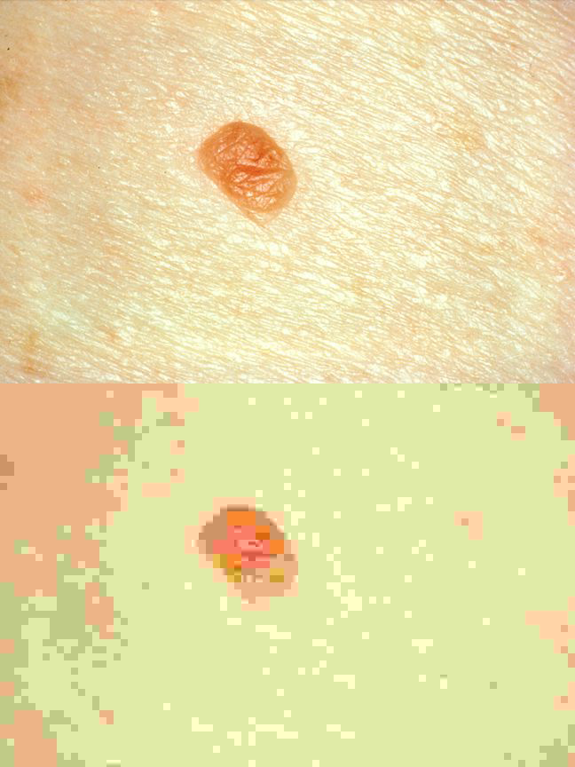

# Introdução {background-color="#2C3E50"}

---

## Bem-vindos à TP8

Hoje trabalhamos dois temas complementares:

::: {.incremental}
- Como se organizam os sistemas de informação em saúde — as suas camadas e a sua arquitectura
- Em que forma existem os dados — formatos, compressão, e o que isso implica para armazenamento e partilha
:::

. . .

Estes temas são a base técnica que suporta tudo o que vimos até agora: interoperabilidade, uso secundário, e o que veremos a seguir — segurança e privacidade.

::: {.notes}
Contextualizar a aula como ponte. Os alunos já conhecem o quê (tipos de dados, normas, utilizadores) — hoje vêem o onde e o como. Perguntar: "Quando guardam uma fotografia no telemóvel, pensam onde ela fica fisicamente? Em que formato? Quanto espaço ocupa?" Estas questões aparentemente triviais têm implicações sérias em contexto clínico.
:::

---

## Materiais

Todos os materiais desta aula estão disponíveis em:

[saudinob.github.io/res2526-tp8](https://SauDInoB.github.io/res2526-tp8)

::: {.notes}
Confirmar que o site está acessível antes de começar. O exercício prático está incluído na própria apresentação — os alunos podem seguir a partir daqui.
:::

---

## Agenda

::: {.incremental}
1. Revisão — tipos de dados e enquadramento legal
2. Arquitectura de sistemas de informação
3. Estratégias de armazenamento — bases de dados e cloud
4. Formatos de ficheiros e compressão
5. Formatos específicos de saúde
6. Exercício prático
:::

::: {.notes}
A aula está dividida em dois blocos. O primeiro (pontos 1 a 3) é mais conceptual — entender como os sistemas se organizam e onde os dados ficam. O segundo (pontos 4 a 6) é mais técnico e prático, e prepara directamente o exercício. Há ligações explícitas às TPs anteriores ao longo de toda a aula.
:::

# Revisão — Dados em saúde {background-color="#2C3E50"}

---

## Tipos de dados em saúde {.smaller}

::: {.columns}
::: {.column width="33%"}
**Estruturados**

Valores em campos bem definidos: resultados de análises, sinais vitais, prescrições, diagnósticos codificados (ICD-10, SNOMED CT).
:::
::: {.column .fragment width="33%"}
**Semi-estruturados**

Com esquema flexível: mensagens HL7, recursos FHIR em JSON/XML, dados de dispositivos IoT.
:::
::: {.column .fragment width="34%"}
**Não estruturados**

Sem esquema predefinido: notas clínicas em texto livre, imagens médicas, gravações de voz, vídeos cirúrgicos.
:::
:::

::: {.notes}
Fazer a ligação com o que já viram. Na TP5 falaram de HL7 e FHIR — esses são semi-estruturados. Na TP6 falaram de dicionários de dados — que servem precisamente para estruturar dados que de outro modo seriam desestruturados. Perguntar: "Em que categoria colocam uma nota de alta hospitalar?" A resposta honesta é que depende — se for texto livre, não estruturado; se for um documento com campos preenchidos, pode ser semi-estruturado.
:::

---

## Enquadramento legal — uma recordação {.smaller}

Os dados de saúde têm estatuto especial em duas dimensões:

::: {.incremental}
- **Lei n.º 12/2005**: os dados de saúde pertencem ao titular — não à instituição que os produz.
- **Art. 9.º do RGPD**: dados de saúde são dados pessoais de categoria especial — o seu tratamento requer base legal reforçada e medidas de segurança acrescidas.
:::

. . .

Estas obrigações condicionam onde os dados podem estar, quem pode aceder, por quanto tempo, e como podem ser partilhados.

::: {.callout-note}
O enquadramento legal é um requisito de arquitectura — não uma consideração posterior ao desenho técnico.
:::

::: {.notes}
Relembrar a TP3 (requisitos de RES) e a TP4 (utilizadores e acessos). Sublinhar que decisões de armazenamento têm implicações legais directas. A TP9 aprofundará estes temas. Exemplo: se um hospital decide guardar dados na cloud, precisa de garantir que o fornecedor cumpre o RGPD e que os dados não saem do Espaço Económico Europeu sem salvaguardas adequadas.
:::

# Arquitectura de sistemas de informação em saúde {background-color="#2C3E50"}

---

## O que é uma arquitectura de SI?

Uma arquitectura de sistema de informação é um plano que define como os dados, as aplicações, as tecnologias e as pessoas se articulam.

. . .

Não é um organigrama, nem um diagrama de rede. É uma linguagem comum que permite:

::: {.incremental}
- perceber o que existe e como se relaciona
- tomar decisões de investimento e integração
- garantir que novos componentes se encaixam no conjunto
:::

::: {.notes}
Evitar frameworks como Zachman ou TOGAF — não são relevantes para este nível. O que importa é a intuição. Exemplo concreto: perguntar aos alunos se já tentaram consultar um resultado de análise clínica no portal do SNS e o resultado ainda não estava disponível, apesar de o colherem há dias. Esse atraso tem uma causa arquitectural — os sistemas do laboratório e o portal não estão integrados em tempo real. Perceber a arquitectura é perceber porquê.
:::

---

## Camadas de arquitectura {.smaller}

::: {.columns}
::: {.column width="55%"}
**Lado do cliente**

- Camada de apresentação: interface gráfica — browser, app móvel, ecrã de posto clínico

**Lado do servidor**

- Camada de aplicação: lógica de negócio, regras clínicas, APIs
- Camada de acesso a dados: queries, mapeamento objeto-relacional
- Camada de dados: bases de dados, sistemas de ficheiros, PACS
:::
::: {.column .fragment width="45%"}
```
┌─────────────────────┐
│   Apresentação      │  ← browser / app
├─────────────────────┤  ─ ─ ─ ─ ─ ─ ─ ─ ─
│   Aplicação         │  ← lógica clínica
├─────────────────────┤
│   Acesso a dados    │  ← queries / APIs
├─────────────────────┤
│   Dados             │  ← BD / ficheiros
└─────────────────────┘
```
:::
:::

::: {.notes}
Usar o SClínico como fio condutor. A interface que o médico vê é a camada de apresentação. As regras que validam uma prescrição (dose máxima, interacções medicamentosas) estão na camada de aplicação. Os dados do utente estão na camada de dados. A camada de acesso a dados é a que "traduz" pedidos da aplicação em operações sobre a base de dados. Perguntar: "Se um médico vê um alerta de interacção medicamentosa, em que camada está essa lógica?"
:::

---

## Exemplos no contexto do SNS {.smaller}

::: {.columns}
::: {.column width="50%"}
**SClínico**

Sistema clínico em centros de saúde e hospitais do SNS. Cobre as quatro camadas:

- Apresentação: interface web para médicos e enfermeiros
- Aplicação: gestão de episódios, prescrição, alertas clínicos
- Acesso a dados: integração com laboratório e imagiologia
- Dados: registos de utentes, episódios, prescrições
:::
::: {.column .fragment width="50%"}
**Plataforma de Dados da Saúde (PDS)**

Camada de integração transversal ao SNS:

- Agrega dados de múltiplos sistemas hospitalares
- Expõe APIs para aplicações autorizadas (SNS 24, portal do utente)
- Implementa o Resumo de Saúde do Utente (RSU)
- Não substitui os sistemas hospitalares — complementa-os
:::
:::

::: {.notes}
Perguntar se algum aluno já acedeu ao portal do SNS ou ao SNS 24. O RSU que aparece no portal vem da PDS, que por sua vez agrega dados de hospitais com sistemas diferentes. Isto é integração — o tema da TP5. A PDS é um exemplo de arquitectura de integração: não centraliza os dados, mas actua como mediador entre sistemas heterogéneos.
:::

# Onde ficam os dados — estratégias de armazenamento {background-color="#2C3E50"}

---

## Bases de dados: três modelos {.smaller}

::: {.columns}
::: {.column width="33%"}
**Relacional**

Tabelas, linhas, colunas. Esquema rígido e predefinido. Adequado para dados estruturados com relações bem definidas.

*Ex: prescrições, análises, faturação.*
:::
::: {.column .fragment width="33%"}
**Documental**

Documentos JSON ou XML, sem esquema fixo. Adequado para dados semi-estruturados ou com estrutura variável.

*Ex: recursos FHIR, notas clínicas estruturadas.*
:::
::: {.column .fragment width="34%"}
**Data lake**

Armazenamento massivo de dados em bruto. Adequado para uso secundário e análise.

*Ex: imagens DICOM, dados de wearables, texto clínico para treino de LLMs.*
:::
:::

::: {.notes}
Ligar à TP6: os dicionários de dados fazem sentido sobretudo para bases relacionais, onde o esquema é rígido. Num data lake, a flexibilidade é maior — mas o risco de "data swamp" (dados sem catálogo, sem metadados, inutilizáveis) também é maior. Perguntar: "Um PACS — sistema de arquivo de imagens médicas — em que categoria enquadram?" É essencialmente um sistema especializado de armazenamento de ficheiros (DICOM), não uma base de dados relacional clássica.
:::

---

## On-premise vs cloud {.smaller}

::: {.columns}
::: {.column width="50%"}
**On-premise**

Servidores físicos instalados no próprio hospital ou datacenter. A instituição controla o hardware, o software e a segurança.

- Tradição dominante nos hospitais portugueses
- Maior controlo directo, maior responsabilidade operacional
- Custos de capital elevados; actualização lenta
:::
::: {.column .fragment width="50%"}
**Cloud**

Infraestrutura gerida por um fornecedor externo (AWS, Azure, Google Cloud). A instituição paga pelo uso.

- Escalabilidade e flexibilidade operacional
- Custos operacionais em vez de capital
- Questões de soberania, jurisdição e localização dos dados
:::
:::

. . .

No SNS, a maioria dos hospitais mantém infraestrutura on-premise, com experiências piloto em cloud para análise de dados secundária.

::: {.notes}
Mencionar que a decisão on-premise vs cloud não é apenas técnica — é política e legal. Perguntar: "Se um hospital português guarda dados de doentes num servidor em Virgínia (EUA), que problemas podem surgir?" As respostas incluem: jurisdição (os dados ficam sujeitos ao direito americano, incluindo o Cloud Act), RGPD (transferências para fora do EEE requerem salvaguardas), e soberania de dados. Não é necessário aprofundar — apenas sensibilizar para a dimensão não técnica da decisão.
:::

---

## Soberania de dados e o EHDS {.smaller}

**Soberania de dados**: os dados estão sujeitos às leis do país onde foram recolhidos — independentemente de onde estão fisicamente armazenados.

. . .

O European Health Data Space (EHDS) propõe um enquadramento europeu:

::: {.incremental}
- **Uso primário**: o utente e o clínico acedem aos dados de saúde em qualquer Estado-membro.
- **Uso secundário**: investigação e inovação — com governação reforçada e consentimento explícito.
- **Infraestrutura federated**: os dados não precisam de sair do país para serem analisados conjuntamente.
:::

::: {.callout-tip}
O EHDS articula directamente com o que viram na TP6 sobre uso secundário de dados de saúde.
:::

::: {.notes}
O EHDS é um regulamento europeu aprovado em 2024, em fase de implementação gradual. O que importa é a ideia central: a Europa quer que os dados de saúde possam ser partilhados para investigação sem que os países percam o controlo sobre eles. A infraestrutura federated resolve isto — em vez de centralizar dados num repositório europeu, os algoritmos de análise "viajam" até aos dados, que ficam nos países. É uma solução arquitectural para um problema de soberania.
:::

# Formatos de dados — porquê importa? {background-color="#2C3E50"}

---

## Da arquitectura ao ficheiro

Até agora falámos de como os sistemas se organizam e onde os dados ficam.

Mas os dados existem sob uma forma concreta: são ficheiros, com um formato específico, guardados em suportes específicos.

. . .

O formato de um ficheiro determina:

::: {.incremental}
- que informação é preservada e o que é descartado na gravação
- quanta capacidade de armazenamento é necessária
- que ferramentas são necessárias para abrir e processar o conteúdo
- se o ficheiro pode ser transmitido de forma eficiente
:::

::: {.notes}
Slide de transição. Pedir aos alunos que pensem num ficheiro de áudio gravado durante uma teleconsulta — formato WAV versus MP3. Qual é a diferença prática? Tamanho, qualidade, compatibilidade com diferentes sistemas. Essas são exactamente as dimensões que vamos explorar. E algumas dessas dimensões têm implicações clínicas e legais directas.
:::

---

## Do bit ao yottabyte {.smaller}

| Unidade | Binário | Decimal | ≈ Folhas A4* | Contexto em saúde |
|---------|---------|---------|--------------|-------------------|
| **bit (b)** | — | — | — | 0 ou 1; interruptor ligado/desligado |
| **byte (B)** | 8 b | 8 b | ½ caractere | Um caractere ('A'); código ASCII |
| **kilobyte (KB)** | 1 024 B | 1 000 B | ½ página | Prescrição simples; 1 segundo de ECG |
| **megabyte (MB)** | 1 024 KB | 1 000 KB | 500 páginas | Radiografia DICOM (~15 MB); 1 min MP3 |
| **gigabyte (GB)** | 1 024 MB | 1 000 MB | 1 000 livros | Estudo TC completo (~500 MB); RES de 1 utente |
| **terabyte (TB)** | 1 024 GB | 1 000 GB | 1 biblioteca | PACS anual de hospital médio (~50 TB) |
| **petabyte (PB)** | 1 024 TB | 1 000 TB | 1 000 bibliotecas | *Data warehouse* SNS; genomas de 100k utentes |
| **exabyte (EB)** | 1 024 PB | 1 000 PB | — | Todo o conteúdo da Web em 2010 |
| **zettabyte (ZB)** | 1 024 EB | 1 000 EB | — | Todo o conteúdo digital mundial (2025) |
| **yottabyte (YB)** | 1 024 ZB | 1 000 ZB | — | Limite teórico atual |

\* Estimativa: 1 página A4 ≈ 2 KB de texto simples; 1 livro ≈ 1 MB

::: {.notes}
Esta tabela estabelece a escala desde a menor unidade (bit) até ao limite teórico actual (yottabyte). Três aspectos importantes:

**1. Binário vs. Decimal**: Os fabricantes de discos (HD, SSD) usam o sistema decimal (1 GB = 10⁹ bytes), enquanto os sistemas operativos usam o sistema binário (1 GiB = 2³⁰ bytes = 1 073 741 824 bytes). Resultado: um disco anunciado como "1 TB" tem apenas ~931 GB de capacidade real visível pelo sistema. Isto é uma fonte frequente de confusão.

**2. Concretização em papel**: Um RES completo de um utente ao longo da vida (50 anos de dados clínicos) ≈ 1-2 GB, o equivalente a ~1 000 livros empilhados. Um hospital de média dimensão gera o equivalente a uma biblioteca municipal por dia de operação.

**3. Limites físicos e futuro**: Um yottabyte (10²⁴ bytes) é o limite atual dos sistemas de ficheiros. Para escala: equivale ao número de grãos de areia em todas as praias da Terra. O armazenamento molecular (DNA) promete revolucionar: 1 grama de DNA pode armazenar ~215 petabytes — toda a informação do mundo numa caixa de sapatos. Já existem protótipos funcionais. Em saúde, isto poderia permitir arquivar o genoma de toda a população mundial num único data center.
:::

---

## Algoritmos de compressão em ação {.smaller}

---

**Exemplo 1: Matemática — padrões repetitivos**

> Quantas operações são necessárias para somar oito 2's?

```
2 + 2 + 2 + 2 + 2 + 2 + 2 + 2 = ?        (8 operações, 15 caracteres)
```

. . .

```
2 × 8 = 16                                 (1 operação, 7 caracteres)
```

**Economia**: ~50% do espaço + menos cálculos

---

**Exemplo 2: Nota clínica — Run-Length Encoding (RLE)**

> **Desafio**: A nota de alta tem 47 palavras. Quantas são únicas?

Texto original:
```
"O doente apresentou dor torácica intensa. A dor era intensa e
persistente. Persistiu dor com irradiação. Dor intensa."
```

Identificando repetições:
- "dor" aparece 4 vezes
- "intensa" aparece 3 vezes

Comprimido (RLE):
```
"O doente apresentou [dor×4] torácica [intensa×3]. Persistente
com irradiação."
```

**Economia**: ~35% do espaço (lossless — sem perda de informação)

---

**Técnicas reais usadas nos formatos:**

| Técnica | Como funciona | Onde é usada |
|---------|---------------|--------------|
| **RLE** | Substitui repetições por [valor×contagem] | ZIP base, imagens BMP |
| **Huffman coding** | Códigos curtos para símbolos frequentes | ZIP, JPEG, MP3 |
| **DCT** | Descarta frequências invisíveis ao olho | JPEG (compressão lossy) |

---

**Para o exercício de hoje:**

> Aplicarão estes conceitos: converter entre formatos é escolher o algoritmo certo para cada tipo de dados — sem perder qualidade perceptível.

::: {.notes}
Este slide ilustra os princípios fundamentais da compressão com dois exemplos concretos:

**Exemplo matemático**: A compressão é identificar padrões. Somar oito 2's é redundante — multiplicar é mais eficiente. Os algoritmos de compressão fazem isto automaticamente: procuram padrões repetidos e substituem por representações mais compactas.

**Exemplo da nota clínica**: RLE (Run-Length Encoding) é o algoritmo mais simples. Em ficheiros reais, algoritmos mais sofisticados como o Huffman coding analisam a frequência de cada símbolo: se "e" aparece 15% das vezes em português, recebe um código binário curto (ex: "01"); se "z" aparece 0,1%, recebe código longo (ex: "111010"). O resultado é um ficheiro mais compacto sem perda de informação.

**DCT (Discrete Cosine Transform)**: Base do JPEG. Transforma a imagem em frequências e descarta as altas frequências (detalhes finos) que o olho humano percebe menos. Por isso o JPEG é lossy — a informação descartada não volta. Em contexto clínico, isto é perigoso: uma mamografia comprimida em JPEG pode perder microcalcificações, que são indicadores precoces de cancro. Daí o DICOM usar JPEG-LS (lossless, baseado em predição) por omissão.

**Ligação ao exercício**: Os alunos vão aplicar este conhecimento prático. Converter WAV para MP3 é aceitar perdas perceptualmente irrelevantes (Huffman + psychoacoustic model). Converter TIFF para JPEG é aplicar DCT. A escolha do formato é a escolha do algoritmo de compressão adequado ao conteúdo e ao contexto de uso.
:::

---

## Classificação por tipo {.smaller}

| Tipo | Formatos comuns | Uso típico em saúde |
|------|-----------------|---------------------|
| Texto | CSV, JSON, XML, TXT | Dados tabulares, recursos FHIR, configuração de sistemas |
| Documento | PDF, DOCX | Relatórios clínicos, notas de alta, consentimentos informados |
| Imagem | JPEG, PNG, SVG, DICOM | Fotografias clínicas, dermatoscopia, radiologia |
| Áudio | WAV, MP3, AAC, FLAC | Ausculta cardíaca, gravações de teleconsulta |
| Vídeo | MP4, AVI, WEBM | Cirurgia, endoscopia, videoconsulta |

::: {.notes}
Não percorrer a tabela linha a linha. O objectivo é dar uma panorâmica — cada linha corresponde a decisões de armazenamento e processamento distintas. Perguntar: "Um electrocardiograma digital — texto, imagem, ou outro?" Pode ser ambos: os dados em bruto são numéricos (estruturados), mas a visualização é uma imagem. Esta ambiguidade é comum em saúde.
:::

---

## Formatos: texto, documento e imagem {.smaller}

| Formato | Compressão | Perda de qualidade | Uso típico |
|---------|------------|---------------------|------------|
| CSV / TXT | Nenhuma | — | Dados tabulares, logs clínicos |
| JSON / XML | Nenhuma | — | APIs, interoperabilidade |
| PDF | Lossless | Não | Documentos formatados |
| JPEG | Lossy | Sim | Fotografia, imagem clínica geral |
| PNG | Lossless | Não | Capturas de ecrã, imagens com transparência |
| DICOM | Lossless (típico) | Não | Imagem médica (radiologia, TC, RM) |

::: {.notes}
Porquê não guardar radiografias em JPEG, sendo que é o formato de imagem mais comum? Porque usa compressão lossy — descarta informação. Perguntar: "Um electrocardiograma digital — texto, imagem, ou outro?" Pode ser ambos: os dados em bruto são numéricos (estruturados), mas a visualização é uma imagem.
:::

---

## Formatos: áudio e vídeo {.smaller}

| Formato | Compressão | Perda de qualidade | Uso típico |
|---------|------------|---------------------|------------|
| WAV | Nenhuma | — | Áudio de alta fidelidade |
| MP3 / AAC | Lossy | Sim | Áudio para distribuição e arquivo |
| FLAC | Lossless | Não | Arquivo de áudio de qualidade clínica |
| MP4 / WEBM | Lossy (típico) | Sim | Vídeo para distribuição e teleconsulta |
| AVI | Variável | Variável | Vídeo, edição cirúrgica |

::: {.notes}
Porquê é que o WAV ocupa tanto espaço comparado com o MP3? Porque não usa nenhuma compressão. Perguntar: "Que tipo de compressão usariam para arquivar a gravação de vídeo de um procedimento cirúrgico endoscópico?" O trade-off entre tamanho e fidelidade diagnóstica é o núcleo da decisão — e prepara directamente o exercício prático.
:::

# Compressão {background-color="#2C3E50"}

---

## Sem perdas vs com perdas {.smaller}

::: {.columns}
::: {.column width="50%"}
**Lossless (sem perdas)**

O ficheiro descomprimido é bit a bit idêntico ao original. Nenhuma informação é descartada.

Usado quando a fidelidade é crítica: texto, código, imagens médicas, arquivos legais.

*Exemplos: PNG, FLAC, DICOM em modo lossless, ZIP, 7z.*
:::
::: {.column .fragment width="50%"}
**Lossy (com perdas)**

O algoritmo descarta informação que considera perceptualmente irrelevante. O ficheiro descomprimido é uma aproximação do original.

Usado quando o tamanho é prioritário e a perda é aceitável para o uso previsto.

*Exemplos: JPEG, MP3, AAC, MP4 com H.264 ou H.265.*

::: {.callout-warning}
Compressão com perdas em imagens de diagnóstico é geralmente inaceitável — pode comprometer a leitura de achados subtis.
:::
:::
:::

::: {.notes}
Exemplo concreto: uma mamografia comprimida com JPEG pode perder detalhes de microcalcificações — alterações que são indicadores precoces de neoplasia. É por isso que o DICOM em modo lossless é o padrão em radiologia. Perguntar: "Que tipo de compressão usariam para arquivar a gravação de vídeo de um procedimento cirúrgico endoscópico?" O trade-off entre tamanho e fidelidade diagnóstica é o núcleo da decisão.
:::

---

## O efeito da qualidade JPEG {.smaller}

::: {.columns}
::: {.column width="60%"}
A compressão JPEG usa um parâmetro de qualidade (0–100) que controla o equilíbrio entre tamanho e fidelidade:

- **Q = 100**: maior fidelidade, maior tamanho
- **Q = 80**: diferenças imperceptíveis; tamanho ~6× menor
- **Q = 50**: artefactos de bloco visíveis em bordos
- **Q = 20**: degradação severa; tamanho ~30× menor

Para uso clínico de diagnóstico, Q abaixo de 95 é geralmente desaconselhado.
:::
::: {.column .fragment width="40%"}

:::
:::

::: {.notes}
Se possível, preparar um exemplo real com uma imagem de domínio público (por exemplo, do dataset ISIC de dermatoscopia). O objectivo não é a discussão técnica do algoritmo DCT subjacente — é a intuição de que compressão com perdas tem consequências visíveis e potencialmente clínicas. Os valores de tamanho dados são ilustrativos; os rácios reais dependem da imagem.
:::

---

## Formatos de arquivo comprimido {.smaller}

Para transferir ou arquivar conjuntos de ficheiros, usam-se formatos de arquivo:

| Formato | Algoritmo | Notas |
|---------|-----------|-------|
| ZIP | Deflate (lossless) | Universal; suportado nativamente em Windows, macOS e Linux |
| RAR | Proprietário (lossless) | Compressão ligeiramente melhor; requer software específico |
| 7z | LZMA (lossless) | Melhor taxa de compressão disponível; open source |
| tar.gz | gzip (lossless) | Padrão em sistemas Unix/Linux; `tar` agrega, `gzip` comprime |

. . .

No exercício prático de hoje, o objectivo é produzir o menor ficheiro `.zip` possível.

::: {.notes}
Notar que estes formatos comprimem o conjunto de ficheiros sem alterar o seu conteúdo — são diferentes de JPEG ou MP3, que alteram o próprio conteúdo durante a gravação. Um ZIP de um conjunto de ficheiros JPEG não vai reduzir muito o tamanho total, porque o JPEG já está comprimido internamente. A escolha do formato do conteúdo é mais determinante do que o formato do arquivo. Esta intuição é central para o exercício.
:::

# Formatos específicos de saúde {background-color="#2C3E50"}

---

## DICOM — o formato da imagem médica {.smaller}

DICOM (Digital Imaging and Communications in Medicine) é o formato padrão para imagens médicas desde 1993.

::: {.incremental}
- **Não é apenas uma imagem**: cada ficheiro DICOM contém a imagem e um conjunto extenso de metadados clínicos estruturados.
- **Os metadados incluem**: identificação do utente, data e hora do estudo, modalidade de aquisição (TC, RM, RX, ecografia, PET), equipamento e parâmetros de aquisição.
- **Os sistemas PACS** (Picture Archiving and Communication Systems) organizam, arquivam e distribuem ficheiros DICOM dentro e entre instituições.
:::

::: {.callout-note}
Na TP5 falámos de interoperabilidade — o DICOM é um dos pilares dessa interoperabilidade em imagiologia, a par de perfis IHE (Integrating the Healthcare Enterprise).
:::

::: {.notes}
Perguntar: "O que acontece quando um doente muda de hospital — o novo hospital consegue abrir os DICOM do anterior?" Em teoria sim, porque o DICOM é um standard. Na prática, há variações de implementação e barreiras institucionais. Mencionar que o DICOM usa compressão lossless por omissão (JPEG-LS ou RLE), embora suporte compressão lossy. Em muitos países, incluindo Portugal, a compressão com perdas em imagens de diagnóstico requer aprovação regulatória específica.
:::

---

## Metadados e privacidade {.smaller}

Um ficheiro digital raramente é apenas o seu conteúdo visível — contém também metadados incorporados na própria estrutura.

::: {.columns}
::: {.column width="50%"}
**JPEG com metadados EXIF**

Uma fotografia tirada com telemóvel pode conter:

- Data e hora exactas
- Coordenadas GPS (geolocalização)
- Fabricante e modelo do dispositivo
- Definições da câmara (ISO, abertura, exposição)

*Uma fotografia de uma lesão cutânea partilhada sem remover os EXIF pode revelar a localização exacta do doente.*
:::
::: {.column .fragment width="50%"}
**DICOM com metadados clínicos**

Um ficheiro DICOM contém nos seus headers:

- Nome, data de nascimento, número de utente
- Identificador do estudo e da série
- Nome do médico requisitante
- Instituição onde o exame foi realizado

::: {.callout-warning}
A partilha de ficheiros DICOM sem anonimização prévia constitui uma violação do RGPD.
:::
:::
:::

::: {.notes}
Esta ponte para a TP9 é deliberada. A privacidade não é apenas uma questão de controlo de acessos — é também uma questão de formato e metadados. Perguntar: "Se eu converter um DICOM para JPEG para partilhar numa reunião clínica, o problema dos metadados desaparece?" Não completamente — depende de como é feita a conversão. Ferramentas específicas de anonimização de DICOM (como o DICOM Anonymizer) existem precisamente para este fim.
:::

# Exercício prático {background-color="#2C3E50"}

---

## Exercício — objectivo

Criar o **menor ficheiro `.zip` possível** a partir de uma pasta com vários ficheiros.

. . .

::: {.columns}
::: {.column width="50%"}
**Ficheiros fornecidos**

- Imagem: `1.jpg` (JPEG, 1.3 MB) e `4.tiff` (TIFF, 29 MB)
- Áudio: `2.wav` (WAV, 1.5 MB), `3.mp3` (MP3, 2.3 MB) e `5.flac` (FLAC, 92 MB)
- Texto: `6.txt` (TXT, 1.2 MB)
- Documento: `7.pdf` (PDF, 826 KB)
:::
::: {.column .fragment width="50%"}
**Logística**

- Trabalho em pares
- Entrega no Moodle da UC
- Download dos ficheiros: [pasta ficheiros/ no GitHub](https://github.com/SauDInoB/res2526-tp8/tree/main/ficheiros) (botão direito → "Save link as..." em cada ficheiro)
:::
:::

::: {.notes}
Distribuir a pasta com os ficheiros neste momento. Os alunos podem trabalhar em pares. Confirmar o prazo de entrega com base no calendário da UC.
:::

---

## Exercício — regras {.smaller}

::: {.columns}
::: {.column width="50%"}
**É permitido**

- Alterar o formato dos ficheiros (converter entre formatos equivalentes)
- Ajustar parâmetros de compressão, desde que não se perca conteúdo perceptível
- Usar ferramentas de conversão online ou instaladas localmente
:::
::: {.column .fragment width="50%"}
**Não é permitido**

- Remover ficheiros da pasta
- Cortar, fazer crop, ou alterar o conteúdo visível ou audível
- Mudar a extensão sem realizar a conversão efectiva
- Reduzir a resolução abaixo de 720p em vídeo ou 72 dpi em imagens
:::
:::

::: {.notes}
A regra central é: comprimir sem degradar. O desafio técnico está em perceber quais os formatos que permitem maior compressão sem perda perceptível de qualidade. Isto obriga os alunos a aplicar o que aprenderam sobre lossless vs lossy.
:::

---

## Exercício — ferramentas

[**123apps.com/pt/**](https://123apps.com/pt/) — conversor online de áudio, vídeo e imagem; não requer instalação.

. . .

Podem usar outras ferramentas, desde que respeitem as regras acima.

::: {.notes}
O 123apps é acessível no browser sem instalar nada — adequado para contexto de sala de aula. Quem tiver ferramentas instaladas (Audacity, HandBrake, FFmpeg) pode usá-las. O objectivo não é a ferramenta em si, mas a decisão de conversão.
:::

---

## Exercício — entregável {.smaller}

Um único ficheiro `.zip` com:

1. Todos os ficheiros convertidos (nomes originais mantidos; extensão pode mudar)
2. Um ficheiro `registo.txt`

. . .

**Estrutura do `registo.txt`** — para cada ficheiro:

| Campo | Exemplo |
|-------|---------|
| Nome do ficheiro original | `audio.wav` |
| Tamanho original | `4 200 KB` |
| Conversão aplicada | `WAV → MP3` |
| Tamanho após conversão | `350 KB` |
| Rácio de compressão | `0.08` |

No final: tamanho do ZIP final, soma dos tamanhos originais, e rácio global.

::: {.notes}
O registo.txt é tão importante quanto o ZIP. Queremos ver que os alunos percebem o que fizeram e porquê — não apenas que conseguiram um ficheiro menor.
:::

---

## Exercício — reflexões {.smaller}

**Perguntas de reflexão** (3 a 5 frases, incluir no `registo.txt`):

> Qual o tipo de ficheiro que mais contribuiu para a redução de tamanho? Porquê?  
> 
> Se tivesse de escolher um formato de arquivo para arquivar estes dados a longo prazo, qual escolheria? Justifique a sua escolha.  
> 
> Que implicações clínicas ou legais poderiam surgir se os ficheiros fossem partilhados sem a conversão adequada?  

---

## Questões e próxima aula

Na TP9: segurança, privacidade e ética em RES — os fundamentos legais e técnicos para proteger os dados que hoje aprendemos a armazenar e a gerir.

. . .

Contacto e materiais:

- Dúvidas sobre o exercício: endereço de e-mail da UC
- Todos os materiais: [saudinob.github.io/res2526-tp8](https://SauDInoB.github.io/res2526-tp8)

::: {.notes}
Terminar com a ligação explícita à TP9. Tudo o que falámos hoje — arquitectura, armazenamento, formatos, metadados — tem implicações de segurança e privacidade que serão o tema da próxima aula. Os alunos devem entregar o exercício antes da TP9; confirmar o prazo exacto com base no calendário da UC.
:::
